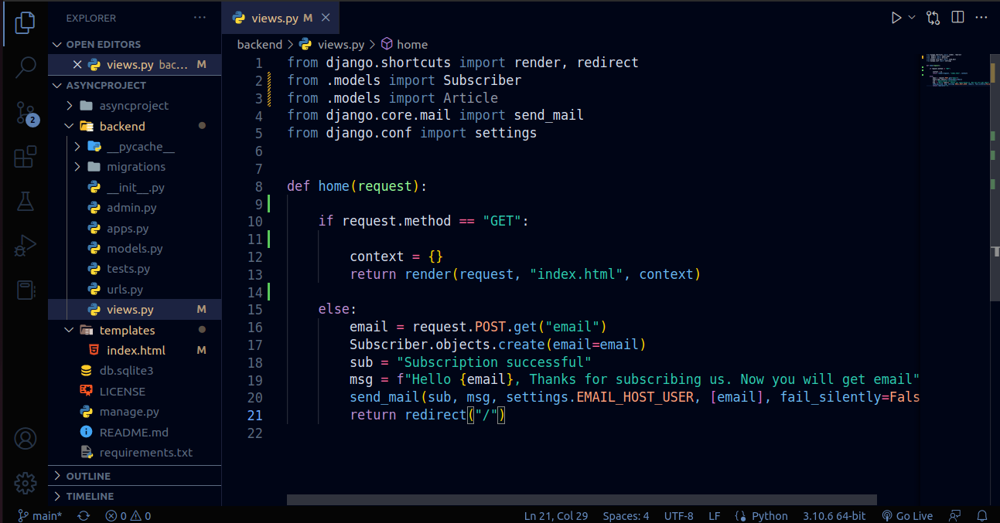
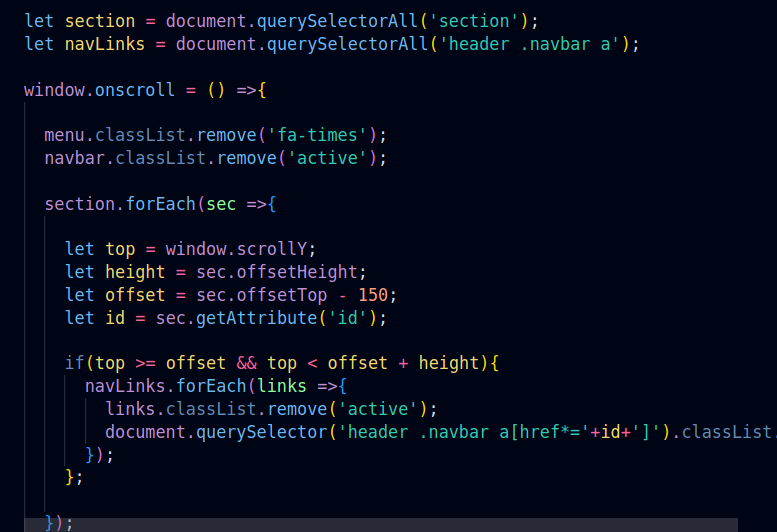
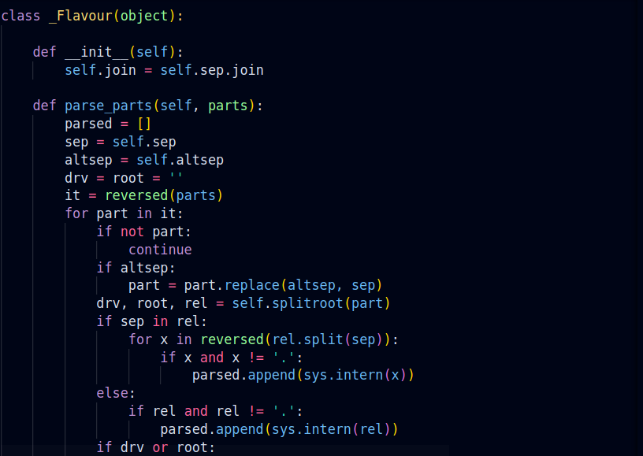

# Aqua Codes 

 

A Visual Studio Code theme inspired by the dark of the night. With coding at night in mind, the colour choices have been taking into consideration with accessibility in mind

# Aqua Codes

# JavaScript

# Python

# Installation

1.  Install [Visual Studio Code](https://code.visualstudio.com/)
2.  Launch Visual Studio Code
3.  Choose **Extensions** from menu
4.  Search for `AuqaCodes`
5.  Click **Install** to install it
6.  Click **Reload** to reload the Code
7.  From the menu bar click: Code > Preferences > Color Theme > **Aqua Codes**

## Authors

Authored by Jumayev Ubaydullo

Icon made by Jamshid Norkhulov 

